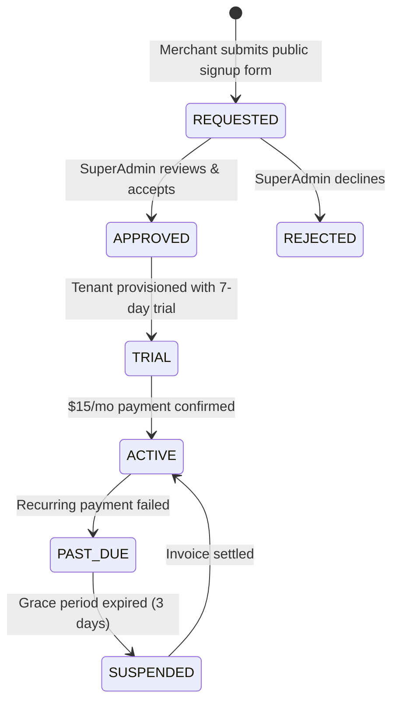

# ADR-006: Merchant Onboarding, Approval Requests & $15/mo Subscription Billing

- **Status**: `Accepted`
- **Date**: 2026-09-15
- **Deciders**: Technical Lead, Senior Architect
- **Consulted**: Product Owner, Finance Lead

---

## Context and Problem Statement

A commercial SaaS cannot rely on manual database seeding for onboarding merchants.
We require a structured workflow where:
1. Business owners (kiosks, pharmacies, restaurants) apply through a public landing page request form.
2. The platform owner (`SUPER_ADMIN`) reviews, approves, or declines incoming requests.
3. Upon approval, the merchant tenant is provisioned with a 7-day free trial and a unique webhook URL.
4. Billing is managed via a recurring $15 USD / month subscription (or equivalent ~115.000 PYG/month) via international and local payment gateways.

---

## Decision Outcome

**Chosen Solution: Two-Stage Onboarding Queue with Pluggable Subscription Billing Engine.**

### 1. Merchant Request Lifecycle:

### 2. Public Application Endpoint:
- `POST /api/v1/public/merchant-requests`
- Payload:
  - `businessName`: e.g. "Kiosko San Roque"
  - `ownerName`: e.g. "Franco Girala"
  - `email`: e.g. "franco@kiosko.com"
  - `phone`: WhatsApp contact number
  - `city`: e.g. "Asunción"
  - `primaryBank`: e.g. "Itaú", "UENO", "GNB"
  - `estimatedDailyTransfers`: e.g. "20-50"

### 3. SuperAdmin Approval & Auto-Provisioning:
- Route: `POST /api/v1/superadmin/merchant-requests/:id/approve`
- Actions executed inside a single database transaction:
  1. Creates `merchants` record with slug (e.g. `kiosko-san-roque`).
  2. Generates dedicated `webhook_secret` (`crypto.randomBytes(32)`).
  3. Creates `MERCHANT_OWNER` user account with temporary password sent via email/WhatsApp.
  4. Seeds default cashier account (`caja1@kiosko-san-roque.com`).
  5. Creates `subscription` record with `status: 'trial'`, expiring in 7 days.

### 4. Subscription & Payment Gateway Integration:
- Pricing: **$15 USD / month** flat per store.
- Providers (Ports & Adapters pattern):
  - **Stripe Billing Adapter**: For international Visa/Mastercard credit and debit cards.
  - **Local Gateway Adapter (Pagopar / Bancard vPOS)**: For local Paraguayan cards and SIPAP debit.
- Webhook reconciliation:
  - `POST /api/v1/webhooks/billing`: Listens for `invoice.paid`, `invoice.payment_failed`.
  - Automatically updates merchant `subscription_status`.

---

## Consequences

### Positive:
- Frictionless lead capture for marketing campaigns (LinkedIn, Meta ads, WhatsApp).
- The platform owner has complete oversight of who joins the network.
- Automated recurring revenue stream with zero manual invoicing.
