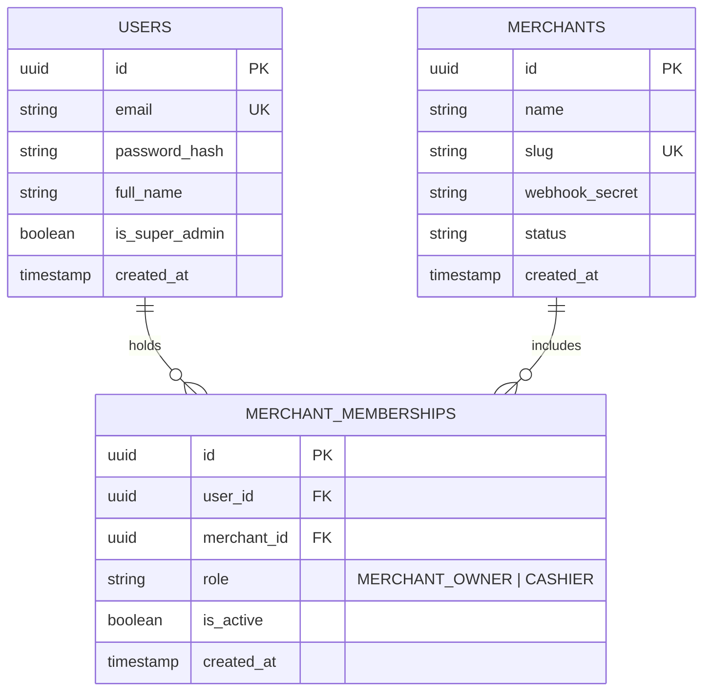

# ADR-008: Multi-Tenant Organization Memberships & Tenant Switching

- **Status**: `Accepted`
- **Date**: 2026-09-16
- **Deciders**: Technical Lead, Senior Architect
- **Consulted**: Security Team, UI/UX Lead

---

## Context and Problem Statement

In retail commerce and franchise operations, a single human user frequently works across multiple businesses with distinct responsibilities:
- An entrepreneur may own two separate kiosks (*"Kiosko San Roque"* and *"Kiosko Central"*) as `MERCHANT_OWNER`.
- A retail cashier may work the morning shift at a bookstore as `CASHIER` and manage a small family grocery store as `MERCHANT_OWNER`.
- An accountant or supervisor may need auditor/read-only access across multiple client stores.

A naive multi-tenant schema where the `users` table contains a single hardcoded `tenant_id` foreign key forces users to register with different email addresses for each store (e.g. `franco+kiosko@gmail.com` vs `franco+farmacia@gmail.com`), creating significant user friction and account sprawl.

---

## Decision Drivers

1. **Single Identity, Multiple Organizations (Slack / Linear / GitHub Model)**: One set of credentials (`email` + `password`) globally identifies a user across the entire platform.
2. **Dynamic Roles per Organization**: A user can hold different roles in different companies (e.g., `MERCHANT_OWNER` in Store A, `CASHIER` in Store B).
3. **Seamless Organization Switching**: Ability to select an organization upon login and switch between stores without signing out.
4. **Strict Cryptographic Scoping**: Every operational API request must be unambiguously bound to exactly one active `tenant_id` at runtime.

---

## Decision Outcome

**Chosen Solution: Decoupled Global Identity (`User`) with Many-to-Many `MerchantMembership` and Two-Stage Token Resolution.**

### 1. Database Relational Model:



- Unique index on `(user_id, merchant_id)` to ensure one active role per user per company.

---

### 2. Two-Stage Authentication & Selection Flow:

#### Stage 1: Credential Verification (`POST /api/v1/auth/login`)
1. User provides `email` and `password`.
2. Password validated via Argon2id / PBKDF2.
3. Server queries all active memberships for the user:
   ```json
   {
     "user": {
       "id": "usr_9912a",
       "name": "Franco Girala",
       "email": "franco@gmail.com",
       "isSuperAdmin": false
     },
     "memberships": [
       {
         "tenantId": "merch_kiosko_1",
         "tenantSlug": "kiosko-san-roque",
         "merchantName": "Kiosko San Roque",
         "role": "MERCHANT_OWNER"
       },
       {
         "tenantId": "merch_farmacia_2",
         "tenantSlug": "farmacia-central",
         "merchantName": "Farmacia Central",
         "role": "CASHIER"
       }
     ],
     "requiresTenantSelection": true
   }
   ```
4. **Auto-Select Fast Path**: If `memberships.length === 1`, the server immediately issues the tenant-scoped token for that sole company.
5. **Multi-Store Flow**: If `memberships.length > 1`, the frontend displays the **Company Selector Modal** (*"Seleccioná la empresa con la que querés operar"*).

#### Stage 2: Tenant Scoped Token Issuance (`POST /api/v1/auth/select-tenant`)
1. Client submits `{ tenantId: "merch_farmacia_2" }` alongside temporary session or bearer token.
2. Server verifies the user holds an active membership for `tenantId`.
3. Issues a scoped JWT containing:
   ```json
   {
     "sub": "usr_9912a",
     "email": "franco@gmail.com",
     "tenantId": "merch_farmacia_2",
     "role": "CASHIER",
     "exp": 1727040000
   }
   ```

---

### 3. In-App Tenant Switcher (`POST /api/v1/auth/switch-tenant`):
- Available from the UI top navigation bar.
- At any point, the user can switch active context from Store A to Store B.
- The server validates membership for the target store and issues a new scoped JWT, avoiding full re-authentication.

---

## Consequences

### Positive:
- Industry-standard SaaS UX (comparable to Slack workspaces or GitHub organizations).
- Business owners managing multiple branches or franchises have a unified login.
- Clean separation between global authentication and tenant-scoped authorization.

### Negative / Mitigations:
- Slightly more complex authentication flow and token refresh logic.
- **Mitigation**: Comprehensive automated unit and E2E tests covering multi-membership login, auto-select single tenant, and unauthorized cross-tenant switching.
