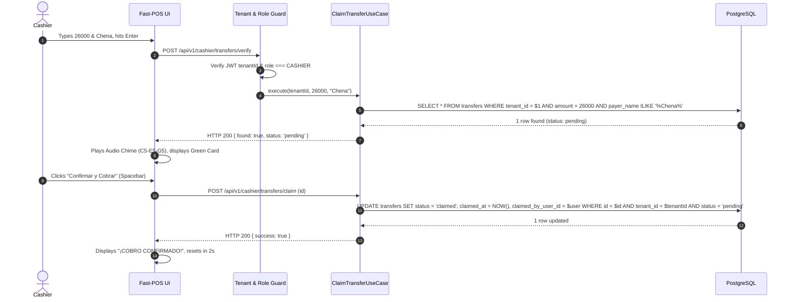

# 📐 Technical Design Document (DESIGN) — Validador PYME SaaS

- **Document Version**: `1.0.0`
- **Status**: `Approved`
- **Date**: 2026-09-16
- **Derives from**: `constitution.md` & `spec.md`

---

## 1. Bounded Contexts & Hexagonal Architecture

```
                                      [HTTP / Webhook Requests]
                                                  │
                                                  ▼
┌──────────────────────────────────────────────────────────────────────────────────────────────────┐
│ PRESENTATION LAYER (Adapters / Inbound)                                                          │
│ - AuthController (Login, SelectTenant, SwitchTenant, Me)                                         │
│ - WebhookController (POST /api/v1/webhook/:tenantSlug)                                          │
│ - CashierController (Verify, Claim)                                                              │
│ - MerchantController (Cashiers CRUD, Settings, Audit)                                            │
│ - SuperAdminController (Merchants, ApprovalQueue, Metrics)                                      │
│ - Guards: JwtAuthGuard, RolesGuard, TenantGuard                                                  │
│ - Interceptors: TenantContextInterceptor (AsyncLocalStorage binding)                             │
└────────────────────────────────────────────────┬─────────────────────────────────────────────────┘
                                                 │
                                                 ▼
┌──────────────────────────────────────────────────────────────────────────────────────────────────┐
│ APPLICATION LAYER (Use Cases / Orchestration)                                                    │
│ - AuthenticateUserUseCase, SelectTenantUseCase, SwitchTenantUseCase                              │
│ - IngestWebhookTransferUseCase                                                                   │
│ - VerifyTransferUseCase, ClaimTransferUseCase                                                    │
│ - ApproveMerchantRequestUseCase, CreateCashierUseCase                                            │
│ - Ports (Interfaces): ITransferRepository, IUserRepository, IMerchantRepository, IBankParser    │
└────────────────────────────────────────────────┬─────────────────────────────────────────────────┘
                                                 │
                                                 ▼
┌──────────────────────────────────────────────────────────────────────────────────────────────────┐
│ DOMAIN LAYER (Pure Business Entities & Value Objects)                                            │
│ - Transfer (state: pending/claimed, claim(), invariants)                                        │
│ - User (global identity, password hashing)                                                       │
│ - Merchant (tenant identity, slug, status, webhook secret)                                       │
│ - MerchantMembership (user_id, merchant_id, role, is_active)                                     │
│ - Subscription (status: trial/active/past_due, expires_at)                                       │
│ - MerchantRequest (lead capture, status: requested/approved/rejected)                            │
└──────────────────────────────────────────────────────────────────────────────────────────────────┘
                                                 ▲
                                                 │
┌────────────────────────────────────────────────┴─────────────────────────────────────────────────┐
│ INFRASTRUCTURE LAYER (Adapters / Outbound)                                                       │
│ - PostgreSQL Persistence (Drizzle ORM / Prisma Client with connection pooling)                   │
│ - Bank Parsers (BankParserFactory: ItauParser, GnbParser, UenoParser, FamiliarParser, etc.)     │
│ - Password Hashing (Argon2id / PBKDF2)                                                           │
│ - Payment Adapters (StripeBillingAdapter, LocalGatewayAdapter)                                   │
└──────────────────────────────────────────────────────────────────────────────────────────────────┘
```

---

## 2. Complete PostgreSQL Relational Schema (DDL)

```sql
-- 1. Merchants Table (Tenants)
CREATE TABLE merchants (
    id UUID PRIMARY KEY DEFAULT gen_random_uuid(),
    name VARCHAR(255) NOT NULL,
    slug VARCHAR(100) UNIQUE NOT NULL,
    webhook_secret VARCHAR(128) NOT NULL,
    status VARCHAR(50) DEFAULT 'active' CHECK (status IN ('active', 'suspended', 'pending')),
    created_at TIMESTAMP WITH TIME ZONE DEFAULT NOW(),
    updated_at TIMESTAMP WITH TIME ZONE DEFAULT NOW()
);
CREATE INDEX idx_merchants_slug ON merchants(slug);

-- 2. Global Users Table
CREATE TABLE users (
    id UUID PRIMARY KEY DEFAULT gen_random_uuid(),
    email VARCHAR(255) UNIQUE NOT NULL,
    password_hash VARCHAR(255) NOT NULL,
    full_name VARCHAR(255) NOT NULL,
    is_super_admin BOOLEAN DEFAULT FALSE,
    created_at TIMESTAMP WITH TIME ZONE DEFAULT NOW(),
    updated_at TIMESTAMP WITH TIME ZONE DEFAULT NOW()
);
CREATE INDEX idx_users_email ON users(email);

-- 3. Merchant Memberships (Many-to-Many with Dynamic Roles)
CREATE TABLE merchant_memberships (
    id UUID PRIMARY KEY DEFAULT gen_random_uuid(),
    user_id UUID NOT NULL REFERENCES users(id) ON DELETE CASCADE,
    merchant_id UUID NOT NULL REFERENCES merchants(id) ON DELETE CASCADE,
    role VARCHAR(50) NOT NULL CHECK (role IN ('MERCHANT_OWNER', 'CASHIER')),
    is_active BOOLEAN DEFAULT TRUE,
    created_at TIMESTAMP WITH TIME ZONE DEFAULT NOW(),
    CONSTRAINT uq_user_merchant UNIQUE (user_id, merchant_id)
);
CREATE INDEX idx_memberships_user_id ON merchant_memberships(user_id);
CREATE INDEX idx_memberships_merchant_id ON merchant_memberships(merchant_id);

-- 4. Bank Transfers (Strictly Scoped by tenant_id)
CREATE TABLE transfers (
    id UUID PRIMARY KEY DEFAULT gen_random_uuid(),
    tenant_id UUID NOT NULL REFERENCES merchants(id) ON DELETE CASCADE,
    operation_id VARCHAR(100) NOT NULL,
    receipt_number VARCHAR(100),
    operation_date VARCHAR(100) NOT NULL,
    payer_name VARCHAR(255) NOT NULL,
    payer_account VARCHAR(100),
    payer_bank VARCHAR(100),
    currency VARCHAR(10) DEFAULT 'PYG',
    amount INTEGER NOT NULL,
    credit_account VARCHAR(100),
    concept TEXT,
    raw_body TEXT,
    status VARCHAR(50) DEFAULT 'pending' CHECK (status IN ('pending', 'claimed', 'expired')),
    claimed_at TIMESTAMP WITH TIME ZONE,
    claimed_by_user_id UUID REFERENCES users(id),
    created_at TIMESTAMP WITH TIME ZONE DEFAULT NOW(),
    CONSTRAINT uq_tenant_operation UNIQUE (tenant_id, operation_id)
);
CREATE INDEX idx_transfers_tenant_lookup ON transfers(tenant_id, amount, status, created_at);

-- 5. Subscriptions Table ($15/mo Lifecycle)
CREATE TABLE subscriptions (
    id UUID PRIMARY KEY DEFAULT gen_random_uuid(),
    tenant_id UUID UNIQUE NOT NULL REFERENCES merchants(id) ON DELETE CASCADE,
    status VARCHAR(50) DEFAULT 'trial' CHECK (status IN ('trial', 'active', 'past_due', 'cancelled')),
    current_period_end TIMESTAMP WITH TIME ZONE NOT NULL,
    external_customer_id VARCHAR(255),
    external_subscription_id VARCHAR(255),
    created_at TIMESTAMP WITH TIME ZONE DEFAULT NOW()
);

-- 6. Merchant Signup Requests (Lead Capture)
CREATE TABLE merchant_requests (
    id UUID PRIMARY KEY DEFAULT gen_random_uuid(),
    business_name VARCHAR(255) NOT NULL,
    owner_name VARCHAR(255) NOT NULL,
    email VARCHAR(255) NOT NULL,
    phone VARCHAR(50) NOT NULL,
    city VARCHAR(100) NOT NULL,
    status VARCHAR(50) DEFAULT 'requested' CHECK (status IN ('requested', 'approved', 'rejected')),
    created_at TIMESTAMP WITH TIME ZONE DEFAULT NOW()
);
```

---

## 3. API Contracts & Endpoints

### 3.1. Authentication Context API
- `POST /api/v1/auth/login`:
  - Request: `{ "email": string, "password": string }`
  - Response (Multi-tenant):
    ```json
    {
      "user": { "id": "uuid", "name": "string", "email": "string" },
      "memberships": [
        { "tenantId": "uuid", "merchantName": "string", "role": "MERCHANT_OWNER" },
        { "tenantId": "uuid", "merchantName": "string", "role": "CASHIER" }
      ],
      "requiresTenantSelection": true
    }
    ```
- `POST /api/v1/auth/select-tenant`:
  - Request: `{ "tenantId": "uuid" }`
  - Response: `{ "accessToken": "jwt_token_with_tenantId_and_role" }`
- `POST /api/v1/auth/switch-tenant`:
  - Request: `{ "targetTenantId": "uuid" }`
  - Response: `{ "accessToken": "new_jwt_token" }`

### 3.2. Webhook Ingestion API
- `POST /api/v1/webhook/:tenantSlug`:
  - Headers: `X-Merchant-Webhook-Secret: <secret>`
  - Request: `{ "text": string, "html"?: string, "subject"?: string }`
  - Responses:
    - `201 Created`: `{ "status": "created", "operationId": "45601", "amount": 26000 }`
    - `200 OK` (Idempotent): `{ "status": "already_exists", "message": "Duplicate ignored" }`
    - `401 Unauthorized`: `{ "error": "Invalid webhook secret" }`

### 3.3. Cashier POS API
- `POST /api/v1/cashier/transfers/verify`:
  - Headers: `Authorization: Bearer <token>`
  - Request: `{ "amount": number, "name": string, "windowMinutes"?: number }`
  - Response (Match):
    ```json
    {
      "found": true,
      "status": "pending",
      "transfer": {
        "id": "uuid",
        "amount": 26000,
        "payerName": "ALEJANDRA CHENA",
        "payerBank": "Banco Itaú",
        "receiptNumber": "7008",
        "operationDate": "15/09/2026 09:34:33"
      }
    }
    ```
  - Response (Already Claimed):
    ```json
    {
      "found": true,
      "status": "already_claimed",
      "claimedAt": "2026-09-15T14:32:00Z"
    }
    ```
- `POST /api/v1/cashier/transfers/claim`:
  - Request: `{ "transferId": "uuid" }`
  - Response: `{ "success": true, "claimedAt": "2026-09-15T14:35:10Z" }`

---

## 4. Sequence Diagrams

### 4.1. Fast-POS Search & Claim Sequence

