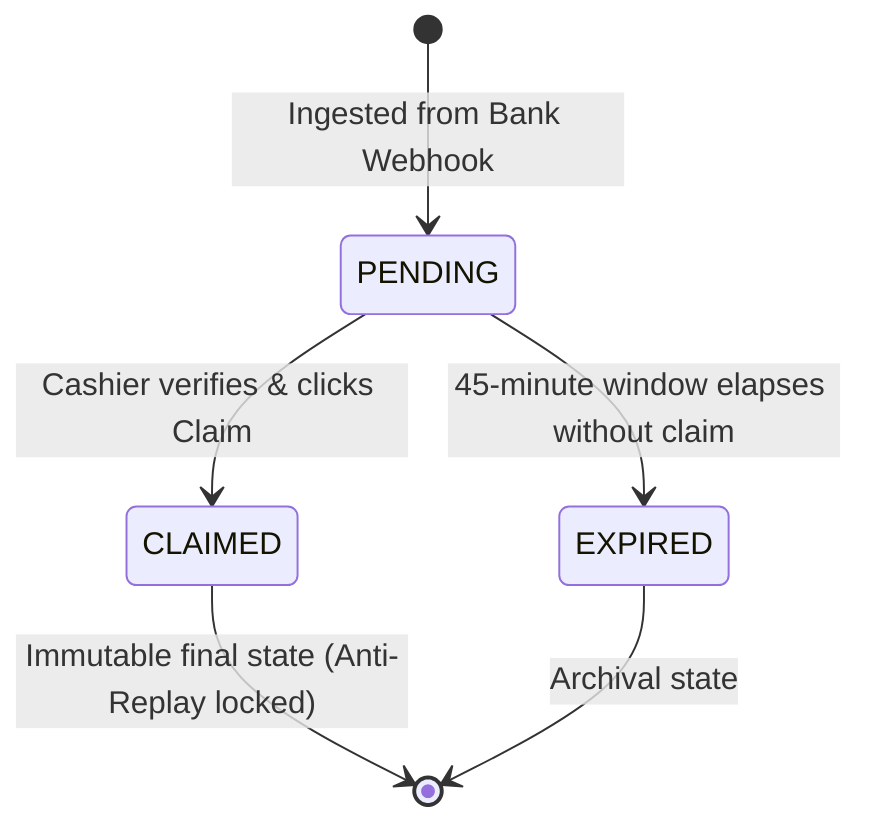
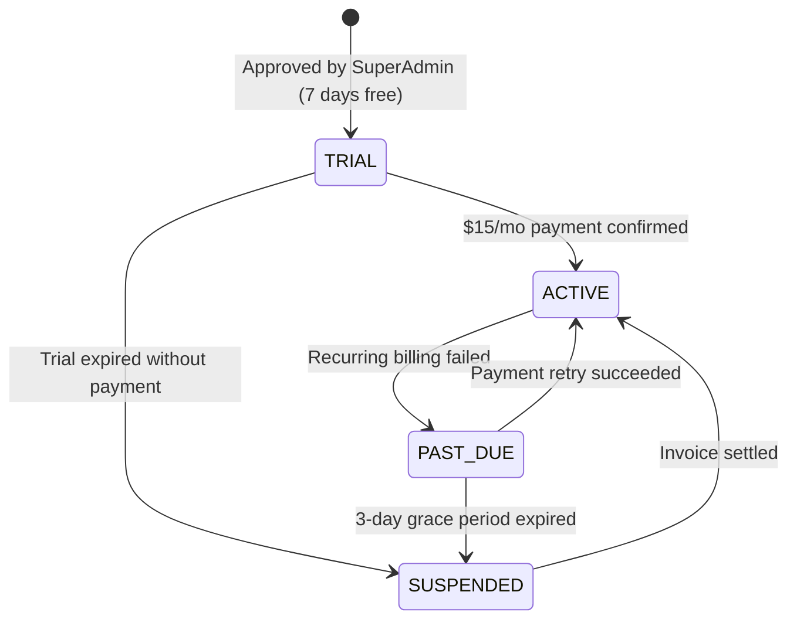

# 📋 Functional Specification (SPEC) — Validador PYME SaaS

- **Document Version**: `1.0.0`
- **Status**: `Approved`
- **Date**: 2026-09-16
- **Aligned with**: `constitution.md` (Articles I – VI)

---

## 1. Actors & Persona Matrix

| Actor Code | Role Name | System Privileges | Boundaries & Constraints |
|---|---|---|---|
| **`ACT-01`** | **`SUPER_ADMIN`** (Platform Owner) | Global visibility across all merchants, approval of onboarding requests, platform metrics, billing overview. | Cannot view unmasked bank credentials or intercept real-time transfers inside active stores. |
| **`ACT-02`** | **`MERCHANT_OWNER`** (Store Owner) | Full control of their store tenant: cashier CRUD, active banks selection, full transfer financial ledger, billing management. | Strictly bounded to their own `tenant_id`. Cannot access other merchants' stores. |
| **`ACT-03`** | **`CASHIER`** (POS Operator) | Query pending transfers by amount + name, execute transfer claim, receive audio/visual confirmation. | Zero access to store financial turnover, bank account numbers, or cashier user management. |
| **`ACT-04`** | **`INGEST_WEBHOOK`** (Automated System) | Ingest incoming parsed transfer payload from Google Apps Script. | Scoped to a specific tenant via secret; cannot query or alter existing claimed transfers. |

---

## 2. Core Functional Requirements (User Stories)

### 2.1. Authentication & Multi-Store Selection

#### `US-AUTH-01`: Multi-Organization Login & Context Switching
> **As a** user who works across multiple businesses (e.g. Owner of Store A, Cashier in Store B),  
> **I want to** log in with my single email and password and choose which company to operate,  
> **So that** I don't need multiple accounts and can switch contexts seamlessly.

- **Scenario 1: Single Store Fast-Path**
  - **Given** user `maria@gmail.com` has an active membership only in `Kiosko San Roque`,
  - **When** Maria submits valid credentials to `POST /api/v1/auth/login`,
  - **Then** the server returns `HTTP 200` with a tenant-scoped JWT bound to `Kiosko San Roque`, bypassing the selection screen.

- **Scenario 2: Multi-Store Organization Selection**
  - **Given** user `franco@gmail.com` holds active memberships in `Store A` (as `MERCHANT_OWNER`) and `Store B` (as `CASHIER`),
  - **When** Franco submits valid credentials to `POST /api/v1/auth/login`,
  - **Then** the server returns `HTTP 200` with a temporary token and a list of available organizations (`memberships` array),
  - **And** the UI presents the Organization Selector Modal.

- **Scenario 3: Tenant Scoped Token Issuance**
  - **Given** Franco selected `Store B` from the modal,
  - **When** the client calls `POST /api/v1/auth/select-tenant` with `{ tenantId: "store_b_id" }`,
  - **Then** the server issues a scoped JWT with `tenantId: "store_b_id"` and `role: "CASHIER"`.

- **Scenario 4: Unauthorized Store Switch Attempt**
  - **Given** an authenticated user with a scoped JWT for `Store A`,
  - **When** the user attempts to switch to `Store C` where they have no membership,
  - **Then** the server returns `HTTP 403 Forbidden { error: "No active membership in this organization" }`.

---

### 2.2. Webhook Ingestion & Anti-Duplicate Pipeline

#### `US-INGEST-01`: Multi-Tenant Bank Email Ingestion
> **As the** automated ingestion subsystem,  
> **I want to** receive parsed bank notifications on a dedicated per-tenant URL,  
> **So that** incoming funds are attributed to the exact store and duplicates are rejected idempotently.

- **Scenario 1: Valid New Transfer Ingestion**
  - **Given** an active merchant `kiosko-san-roque` with secret `sec_xyz123`,
  - **When** Google Apps Script posts a valid transfer email to `POST /api/v1/webhook/kiosko-san-roque` with header `X-Merchant-Webhook-Secret: sec_xyz123`,
  - **Then** the system parses operation ID `45601`, amount `26000`, and payer `ALEJANDRA CHENA`,
  - **And** saves the transfer with status `PENDING` linked to `kiosko-san-roque`,
  - **And** returns `HTTP 201 Created { status: "created", id: 101 }`.

- **Scenario 2: Duplicate Ingestion (Google Retry)**
  - **Given** transfer `45601` is already registered for `kiosko-san-roque`,
  - **When** Google Apps Script delivers the same email again,
  - **Then** the unique constraint `(tenant_id, operation_id)` catches the duplicate,
  - **And** the server returns `HTTP 200 OK { status: "already_exists" }` without mutating state.

- **Scenario 3: Invalid or Missing Webhook Secret**
  - **When** a request arrives at `POST /api/v1/webhook/kiosko-san-roque` with an incorrect secret,
  - **Then** the server performs constant-time comparison and returns `HTTP 401 Unauthorized { error: "Invalid webhook secret" }`.

---

### 2.3. Cashier Point-of-Sale Verification & Anti-Replay

#### `US-POS-01`: High-Speed Transfer Search and Claim
> **As a** store cashier,  
> **I want to** verify customer payment by typing only the exact amount and their last name,  
> **So that** the customer can walk away in seconds without showing their phone or causing queues.

- **Scenario 1: Successful Match and Claim**
  - **Given** a pending transfer of `Gs. 26.000` from `ALEJANDRA CHENA` received 5 minutes ago,
  - **When** the cashier enters `26000` and `Chena` and hits `Enter`,
  - **Then** the system finds the exact match and returns `status: "pending"`,
  - **And** the UI triggers the ascending positive audio chime and displays the green verification card,
  - **When** the cashier clicks "Confirmar y Cobrar",
  - **Then** the server transitions the transfer to `CLAIMED` with the cashier's user ID and timestamp,
  - **And** the form resets cleanly.

- **Scenario 2: Anti-Replay Attack Prevention (Duplicate Voucher)**
  - **Given** transfer `45601` was already claimed at `14:32:00` by cashier `Carlos`,
  - **When** another customer presents the same voucher and cashier queries `26000` and `Chena`,
  - **Then** the system finds the matching transfer but recognizes `status === "claimed"`,
  - **And** the server returns `status: "already_claimed"` with `claimedAt: "14:32:00"`,
  - **And** the UI displays an alert in **RED** and sounds a low dissonance warning tone,
  - **And** instructions state: *"⛔ NO entregar mercadería. Comprobante ya utilizado"*.

- **Scenario 3: Transfer Outside Window (Time Expiry)**
  - **Given** a transfer arrived 50 minutes ago (exceeding default 45m window),
  - **When** the cashier queries the amount and name,
  - **Then** the system returns `found: false`, keeping older transfers invisible to store operators.

---

### 2.4. Merchant Onboarding & SuperAdmin Approval

#### `US-ONB-01`: Public Request & Automated Provisioning
> **As a** prospective merchant owner,  
> **I want to** apply for access through a simple public landing form,  
> **And as a** SuperAdmin, I want to approve the application with one click,  
> **So that** the merchant is provisioned with a 7-day trial and custom webhook URL immediately.

- **Scenario 1: Public Merchant Application**
  - **When** an owner submits `{ businessName: "Farmacia Central", email: "dueño@farmacia.com", phone: "+595981123456", city: "Asunción" }`,
  - **Then** a `merchant_requests` record is created with status `REQUESTED`.

- **Scenario 2: SuperAdmin Approval & Transactional Provisioning**
  - **Given** application `#12` is in `REQUESTED` status,
  - **When** the SuperAdmin calls `POST /api/v1/superadmin/merchant-requests/12/approve`,
  - **Then** in a single ACID transaction:
    1. `merchants` record is created with slug `farmacia-central`.
    2. A 32-byte cryptographic webhook secret is generated.
    3. A `MERCHANT_OWNER` user account is created.
    4. A `merchant_memberships` record is linked.
    5. A 7-day `TRIAL` subscription is activated.
    6. Application `#12` status transitions to `APPROVED`.

---

## 3. Finite State Machines (FSM)

### 3.1. Bank Transfer Lifecycle FSM

### 3.2. Merchant Subscription Lifecycle FSM

---

## 4. Edge Cases & Boundary Matrix

| Scenario | Input Condition | Expected System Behavior | Constitutional Invariant |
|---|---|---|---|
| **Accented / Special Name Characters** | Customer input: `"Giménez"`, Bank email: `"GIMENEZ"` | Normalization removes diacritics before matching; case-insensitive comparison matches successfully. | Usability & Robustness |
| **Race Condition on POS Claim** | Two cashiers at separate registers click "Claim" on the exact same millisecond | Database row lock (`FOR UPDATE` or atomic `UPDATE ... WHERE status = 'pending'`) awards claim to first transaction; second receives `already_claimed`. | Article II (Anti-Replay) |
| **Cross-Tenant Parameter Tampering** | Authenticated cashier from Tenant A passes `tenantId` of Tenant B in query payload | Interceptor overrides payload with JWT tenant claim; cross-tenant query is strictly impossible. | Article I (Isolation) |
| **Network Failure During Claim** | Cashier clicks Claim, network drops before receiving HTTP 200 | Cashier retries; system returns `already_claimed` with the cashier's own recent timestamp, confirming claim succeeded. | Article II (Anti-Replay) |
